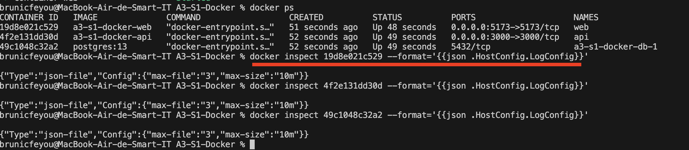
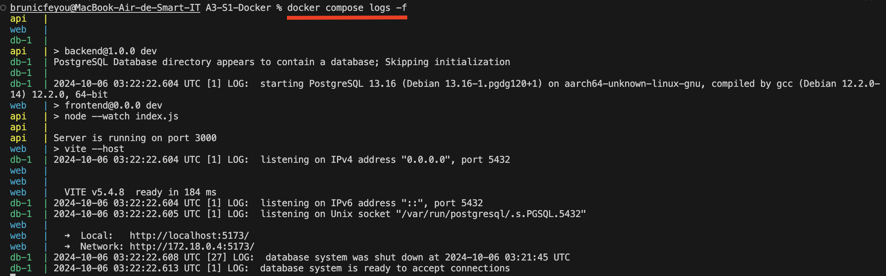
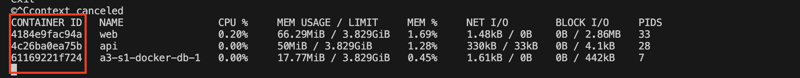

# Rendu docker 
_(juste en dessous des badges sympatiques à placer)_

  

Ce projet est la création d'une une application complète
comprenant plusieurs services. Elle configure et
déploye ces services à l'aide de Docker et Docker Compose tout en
respectant les bonnes pratiques de sécurité, de gestion des logs et de
monitoring.

## Pour commencer

Clonez le projet sur votre machine  

### Pré-requis

Ce qu'il est requis d'avoir pour commencer avec votre projet...

- Installer et ouvrer docker moteur sur notre machine 
- Installer et mettre en marche une base de données PostgreSql

### Installation

Une fois le projet cloné et les pré-requis installés suivez ces étapes dans l'ordre : 

 - ##### Exécuter dans le dossier du projet : 
  `docker compose up -d`
 

Ensuite vous pouvez montrer ce que vous obtenez au final...

## Démarrage

- ##### Ouvrir deux fênetres de votre navigateur 
<http://localhost:5173/> pour le front de votre application
<http://localhost:3000/> pour le backend de votre application -> Vous aurez l'affichage d'un message "Hello"
 
- ##### A partir de la seconde URL ajoutez deux chemin : 
<http://localhost:3000/create-table> pour créer une table user dans votre base de donnees postgres. 
Ensuite, <http://localhost:3000/add-user> pour créer un personnage nommé John Doe dans votre base de donnés avec son email johndoe@email.fr .

Ensuite vous pouvez montrer ce que vous obtenez au final...

## Fabriqué avec

* [React](https://fr.react.dev/) - Bibliothèque javascript (front-end)
* [Node](https://nodejs.org/fr) - API (back-end)
* [Postgres](https://www.postgresql.org/) - Base de données (back-end)

## Versions
Listez les versions ici 
_exemple :_
**Dernière version stable :** 5.0
**Dernière version :** 5.1
Liste des versions : [Cliquer pour afficher](https://github.com/your/project-name/tags)
_(pour le lien mettez simplement l'URL de votre projets suivi de ``/tags``)_

## Auteurs

* **Aurore Dimech** 
* **Brunic Feyou**
* **Allia Jarjir**

## Informations additionnelles

Vous trouverez dans le dossier "**screenshoots**" de ce projet des captures d'écran du terminale montrant quelques tests effectués lors de la constructions de ce dernier. 

Voici les explications descritives de ce qu'acccomplissent les commandes utilisées : 

##### Gestion des logs  
- La commande `docker inspect <container_id> --format='{{json.HostConfig.LogConfig}}'`
 nous permet de vérifier la configuration et la rotation des logs de chaque service.
Les loggings driver son mise en place directement dans le fichier `docker-compose.yml`
 

- La commande `docker composer logs -f`  nous permet de suivre les logs en temps en réel. 

##### Monitoring 
-  La commande `docker stats` nous permet de surveiller l’utilisation des ressources (CPU, mémoire, réseau).

